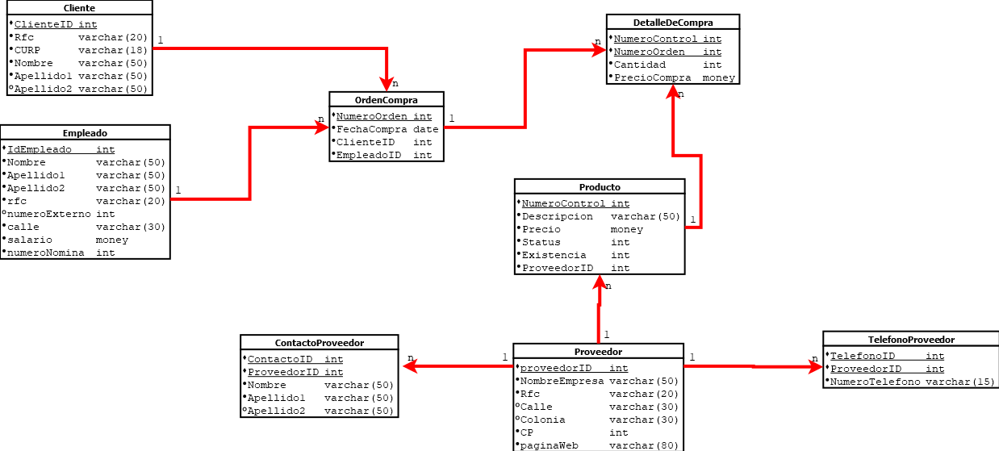
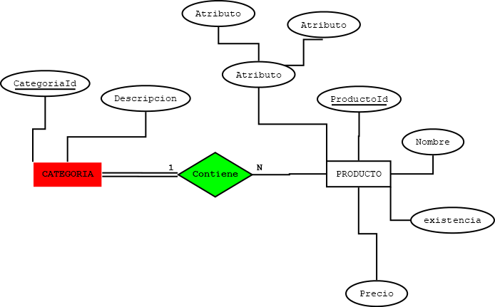

# Requerimientos
Una empresa encargada de las ventas de diferentes productos desea crear una base de datos que controles los proveedores, clientes, empleados, categorías de producto y órdenes de compra. Para los proveedores se necesita almacenar un numero de control, nombre de la empresa, dirección (numero, calle, colonia, estado), cp,teléfono, página web, teléfono de contacto o contactos del proveedor, nombre del contacto, email del contacto. Para los empleados se desea almacenar un numero de nómina, nombre completo del empleado, rfc, curp, salario (El salario máximo es de 65000), para las ordenes de compra se necesita almacenar la fecha de creación de la orden, el empleado que la realizo, al cliente que se le vende, la fecha de entrega y los diferentes productos que contiene. El producto debe almacenar un numero de control y una descripción única, status, existencia y un precio. La categoría debe tener un identificador y nombre único de categoría. La compra siempre debe tener un precio de venta que se obtiene del precio unitario del producto y una cantidad vendida.

# Diagrama E-R


# Diagrama Relacional


# Creacion BD con lenguaje SQL-LDD
```sql
-- Crear base de datos Ventas 
create database bdventas;

-- Acceder a la base de datos Ventas 
use bdventas;

-- Crear tabla clientes 
create table Cliente(
    ClienteId int not null identity(1,1),
    RFC varchar(20) not null,
    CURP varchar(18) not null,
    Nombres varchar(50) not null,
    Apellido1 varchar(50) not null,
    Apellido2 varchar(50) not null,
    constraint pk_Cliente_cliente primary key (ClienteId),
    constraint unico_Cliente_rfc unique(RFC),
    constraint unico_Cliente_curp unique (CURP)
);

-- Crear tabla contacto_proveedor 
create table ContactoProveedor(
    ContactoId int not null identity(1,1),
    Proveedorid int not null,
    Nombres varchar(50) not null,
    Apellido1 varchar(50) not null,
    Apellido2 varchar(50) not null,
    constraint pk_contactoProveedor primary key (ContactoId)
);

-- Crear tabla proveedor 
create table Proveedor(
    ProveedorId int not null identity(1,1),
    nombreEmpresa varchar(50) not null,
    RFC varchar(20) not null,
    Calle varchar(50) not null,
    Colonia varchar(50) not null,
    CP varchar(50) not null,
    Paginaweb varchar(50) not null,
    constraint unico_Proveedor_rfc2 unique (rfc),
    constraint unico_Proveedor_nombreEmpresa unique (nombreEmpresa),
    constraint pk_proveedor primary key (ProveedorId)
);

-- Modificar tabla Contacto Proveedor
alter table ContactoProveedor add constraint fk_ContactoProveedor_Proveedor foreign key (Proveedorid) references Proveedor(Proveedorid) 

-- Tabla empleado
create table Empleado (
    EmpleadoId int identity(1,1) not null,
    Nombre varchar(50) not null,
    Apellido1 varchar(50) not null,
    Apellido2 varchar(50) not null,
    Salario money not null,
    NumeroNomina int not null,
    CURP varchar(18) not null,
    RFC varchar(20) not null,
    calle varchar(50) not null,
    numeroExterno int,
	constraint unico_Empleado_rfc3 unique (rfc),
    constraint unico_Empleado_curp2 unique (CURP),
    constraint unico_Empleado_numeroNomina unique (NumeroNomina),
    constraint pk_Empleado primary key (EmpleadoId),
	constraint chk_Empleado_salario check (Salario>0.0 and Salario<=100000)
	-- check (Salario between 0.1 and 100000)
);

-- Tabla Telefono del Proveedor
create table TelefonoProveedor(
	TelefonoID int not null, 
	ProveedorId int not null, 
	numeroTelefono varchar(15),
	constraint pk_TelefonoProveedor primary key (TelefonoID,ProveedorId),
	constraint fk_TelefonoProveedor_provedorId_Proveedor foreign key (ProveedorId) references Proveedor(ProveedorId) 
	on delete cascade
	on update cascade
);


-- Tabla producto
create table Producto (
    NumeroControl int identity(1,1),
    Descripcion varchar(50),
    Precio money not null,
    [Status] int not null,
    Existencia int not null,
    Proveedorid int not null,
	constraint pk_Producto_NumeroControl  primary key (NumeroControl),
	constraint unico_Producto_Descripcion unique (Descripcion),
	constraint chk_Producto_Precioo check(Precio between 0.1 and 200000),
	constraint chk_Producto_Status check([Status] = 1 or [Status] =0),
	constraint chk_Producto_Existencia check(Existencia>=0),
    foreign key (ProveedorId) references Proveedor(ProveedorId)
);

-- Tabla de Orden Compra
create table OrdenCompra (
	numeroOrden int not null identity(1,1),
	fechaCompra date not null,
	fechaEntrega date not null, 
	ClienteId int  not null,
	EmpleadoId int not null,
	constraint pk_OrdenCompra_numeroOrden  primary key (numeroOrden),
	constraint fk_OrdenCompra_Cliente foreign key (ClienteId) references Cliente(ClienteId), 
	constraint fk_OrdenCompra_Empleado foreign key (EmpleadoId) references Empleado(EmpleadoId) 
);

-- Tabla detalles de compra
create table DetalleCompra (
    ProductoId int not null,
    numeroOrden int not null,
    cantidad int not null,
    preciocompra money not null,
   constraint pk_DetalleCompra_DetalleCompra  primary key (ProductoId,numeroOrden),
   constraint fk_DetalleCompra_numeroOrden foreign key (numeroOrden) references OrdenCompra(numeroOrden) ,
   constraint fk_DetalleCompra_Producto foreign key (ProductoId) references Producto(NumeroControl) 
);
```
# Llenar base de datos con lenguaje SQL-LMD

```sql
use [bdventas]

select * from [Northwind].dbo.customers;

-- Consulta los datos de la tabla cliente
select * from  Cliente;

-- Elimina los datos de la tabla cliente
delete from Cliente

-- Comando para reiniciar el identity de una tabla
DBCC CHECKIDENT (cliente, RESEED, 0)

-- Crea una tabla apartir de una consulta
select top 0 EmployeeID as 'EmpleadoId', LastName as 'Apellido', FirstName as 'PrimerNombre', BirthDate as 'FechaNacimieto', HireDate as 'FechaContratacion', [address] as 'Direccion', city as 'Ciudad', region, PostalCode as 'CodigoPostal', Country as 'Pais' 
into Empleado2 from [Northwind].dbo.Employees

-- Consulta la tabla 
select *from Empleado2

-- Agraga la llave primaria la tabla empleado
alter table Empleado2 add Constraint pk_empleadoId primary key(EmpleadoId)

-- Consulta los ultimos 5 registros 
select top 5 * from [Northwind].dbo.[Order Details]
order by OrderID desc

-- Insertar datos
insert into Empleado2(EmpleadoId, Apellido, PrimerNombre, FechaNacimieto, FechaContratacion, Direccion, Ciudad, region, CodigoPostal, Pais)
select EmployeeID as 'EmpleadoId', LastName as 'Apellido', FirstName as 'PrimerNombre', BirthDate as 'FechaNacimieto', HireDate as 'FechaContratacion', [address] as 'Direccion', city as 'Ciudad', region, PostalCode as 'CodigoPostal', Country as 'Pais' from [Northwind].dbo.Employees

select * from Empleado2 

select * from Empleado

select * from Cliente

select * from  OrdenCompra

insert into Empleado(Nombre, Apellido1, Apellido2, CURP, RFC, numeroExterno, calle, Salario, NumeroNomina) values 
('Alan','Sntiago','Molina','ALM456789','ALMN3435',23,'Calle del infierno', 67890.9,1234),
('Yamileth','Mejia','Rangel','YMR456789','YMRN3435',null,'Calle del hambre', 77890.17,23456),
('Moises','Santiago','Isidro','MSI456789','MSIN3435',null,'Calle de la gordura', 20000,98765);

select * from Producto;

select * from Northwind.dbo.Products;

select * from Proveedor;

select * from Northwind.dbo.Suppliers;

insert into Proveedor select supplierID, CompanyName,PostalCode,'Calle de la sol',City,2345 as CP,'www.prueba.com.mx' as 'PaginaWeb' from Northwind.dbo.Suppliers;

select * from Producto;

insert into Producto select ProductID, ProductName,UnitPrice,Discontinued,UnitsInStock,SupplierID from Northwind.dbo.Products;

-- Fecha actual del Sistema
select getdate();

insert into OrdenCompra values 
(getdate(),'2024-06-10',1,1),
(getdate(),'2024-06-10',2,2),
(getdate(),'2024-07-11',3,3);

select * from OrdenCompra ;

insert into DetalleCompra values
(1,1,30,(select precio from Producto where NumeroControl=1)),
(1,3,30,(select precio from Producto where NumeroControl=1)),
(2,2,10,(select precio from Producto where NumeroControl=2));

select * from DetalleCompra;

update Producto set Precio=20.2 where NumeroControl=1;

-- Seleccionar las ordenes de compra realizadas al producto 1
select *,(cantidad*preciocompra) as Importe from DetalleCompra where ProductoId=1;

-- seleccione el total a pagarde las ordenes que contienen el producto 1
select sum(cantidad*preciocompra) as Total from DetalleCompra where ProductoId=1
```

